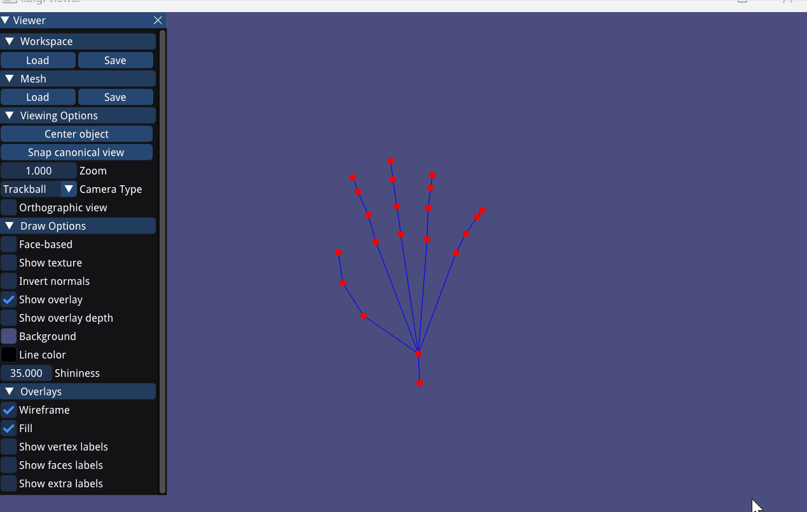
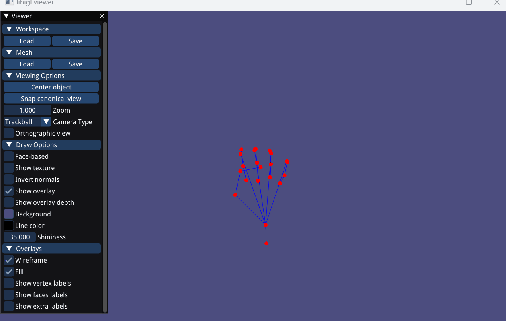
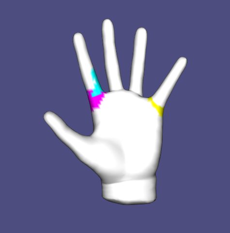
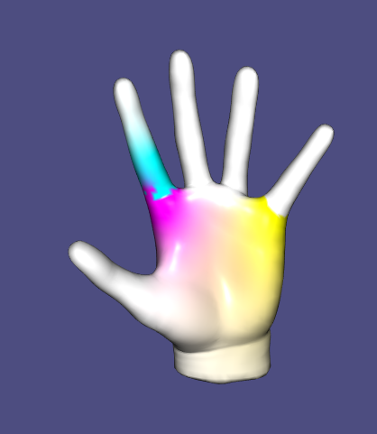
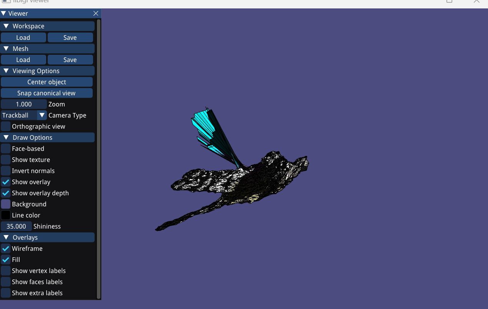

# Assignment 6: Skinning & Skeletal Animation

Name: Cedric Tschechtelin

Legi-Nr: 20-916-342

## Required results
Edit this 'README.md' file to report all your results. Use the `./res` folder to store your results.

### Tasks

1. Read Sec. 1 carefully to get familiar with the data format, problem formulation, and mathematical background.
2. (Task 2) two theoretical discussions 
3. (Task 3) visualize the animation of the input skeleton of the hand shape from two types of input rotations (sequence and )
4. (Task 4) compute harmonic skinning weights on selected handles
5. (Task 5) per-vertex LBS + rotation/translation + Lerp
6. (Task 6) per-vertex LBS + dual quaternion + Nlerp
7. (Task 7) per-face LBS + averaging rotation + Poisson Stitching
8. (Task 8.1) context-aware per-vertex LBS
9. (optional Task 8.2) context-aware per-face LBS
 
### Important Note
1. We do not provide a template code for this assignment - feel free to use the previous template code if you want
2. You can use any functions in libigl, and its dependencies (and [libhedra](https://avaxman.github.io/libhedra/) if you want).
3. You are allowed to use your previous code (for example, you will find the Poisson Stitching technique quite similar to the Deformation Transfer that you have implemented in Assignment 5; and also the provided handle selection in A5 might inspire you to design your handle selection tool in Task 4).
4. You are allowed to modify this report freely (but please try to stick to some table format of orangizing figures to avoid a 20-page long report)
5. Please feel free to try other skeletal animation/deformation data you can find online if you find the provided animation is not cool enough (for example [here](https://www.mixamo.com/#/), but note that they might be in a different data format than the provided ones).
6. Please try to keep your code clean and self-explained (with necessary comments), since we will grade this assignment based on your code as well.

## Reports

### Task 2: Rotation Representation discussion
#### Task 2.1. compare different rotation representations

| Representions        |  Short Description  |     pros            |      cons           |
| :------------------: |:------------------: |:------------------: |:------------------: |
| rotation matrix      | It's a 3x3 Matrix whose columns are of unit length and orthogonal, when translation is included the bottom row becomes the translation vector and hence it has dimension 4x3. Determinant is 1.0. The set of all such matrices are the group SO(3). We take all 9 elements of the matrix as parameters for our rotation, which gives us a linear function              |Linear optimizations possible, obvious partial derivatives and rotations, linear function of parameters.               | Must use six non-linear constraints to ensure matrix stays in SO(3), as 9 parameters are altered independently, requires integrating ODE and each rotation must be renormalized.              |
| euler angles         | Euler angle represents a rotation about one of the coordinate axis = 1 DOF. There are 3 functions Rx, Ry, Rz for computing rotation around a certain axis. Involve sine and cosine of euler angle, nonlinear but easily computable derivatives.              |only 3 DOF euler rotations based on cosine and sine, easy derivatives, easy interface for animators. Works well in all applications with one or two DOF rotations.               | Gimbal lock due to singularities (loosing of 1 DOF if axis of 2 Rotations match), there is a direction where forces do not apply. Interpolation of Rotation are poor since all Rotations are independent from each other              |
| axis angle           | Represented using a unit axis and angle (n, omega) pair. Can easily be converted to and from matrix.              |Directly represents the action of rotation, and intuitive to work with.               | Numerical errors can change angle, infinite number of angle choices, no linear axis-angle interpolation interpolating the angle alone causes jumps.              |
| quaternions          | Quaternions form a group of four dimensional vector space to represent rotations. The group contains dot and cross product of vectors as group operators. We can define as Quaternion q = w + xi + yj + zk, with i, j, k as unit vectors or as q = [cos(omega/2), sin(omega/2)v] encoding a rotation of omega radians about the unis axis v. Quaternion is a double cover of the group SO(3), i.e. each rotation in SO(3) can be represented by 2 quaternions. Rotations can be carried out by only using quaternion multiplications. Rotate(x) = q ° ~x ° q_conj._             | free from gimbal lock, simple formulae for computing rotation matrix and partial derivatives from a unit quaternion. S3 space good for interpolations, same topology as SO(3), ability to specify closed form hermite curves on S3.               | Relies on quaternions remaining in S3, maintaining unit length, else there are non_rotations, Integrating ODEs in parameter space is problematic, it quickly pushes point out of S3_              |

#### Task 2.2. Theoretical question for dual quaternions

| Euler angles -> rotation  matrix |  rotation matrix -> quaternion  |    quaternion + translation -> dual quaternion   |
| :------------------------------: |:------------------------------: |:-----------------------------------------------: |
| concatenating three single-axis rotation matrices. R = Rx(alpha) * Ry(beta) * Rz(gamma) with alpha, beta, gamma as angles.| 1. Compute unit eigenvector for the eigenvalue 1 for rotation matrix, call it u = (u1, u2, u3). 2. Tr(M) = 2 * cos(omega) + 1 -> get omega. Then get Quaternion q = cos(omega/2) + u * sin(omega/2)|quaternion q0, translation t1, t2, t3, quaternion units i,j,k, e dual operator -> q = q0 + e / 2 * (t1*i + t2*j + t3*k)*q0| 

### Task 3: animation of the skeleton
|                       rotaton sequence                       |               interpolation to target rotation                |
|:-------------------------------------------------------------:|:-------------------------------------------------------------:|
|  |  |

### Task 4: computing harmonic skinning weights on selected handles
#### Task 4.1. handle selection
| shape name           |  joint 1            |  joint 2            |  joint 3            |
| :------------------: |:------------------: |:------------------: |:------------------: |
| hand |   

#### Task 4.2. skinning weights visualization
| shape name           |  joint 1            |  joint 2            |  joint 3            |
| :------------------: |:------------------: |:------------------: |:------------------: |
| hand |  

### Task 5/6/7: skeletal animation 
|                   Task 5: Linear Blend Skinning                    |                   Task 6: Dual Quaternion Skinning                   |     Task 7: per-face + averaging quaternions     |
|:-------------------------------------------------------------:|:-------------------------------------------------------------:|:-------------------------------------------------------------:|
|  |  |  |

Your comments (how these setups differ from each other, and please compare the visual effects)

| Task 5: Linear Blend Skinning   | Task 6: Dual Quaternion Skinning      | Task 7: per-face + averaging quaternions  |
| :---------:                            |        :---------:                           |       :---------:                          |
| Joints can collapse "candy wrapper" effect. Not preserving volume and weird rotations of joints when bone rotate. |more realistic rotations around joints, avoids this "candy wrapper", slower than lbs | more detailed and locally preciser, different parts of mesh can be influenced by multiple bones, slower than lbs            |

### Task 8.1: context-aware per-vertex LBS
#### Task 8.1.1 visualize the unposed example shapes
| shape name           |  pose 1             |   pose 2            |   pose 3            |
| :------------------: |:------------------: |:------------------: |:------------------: |
| human |   |  |  |

#### Task 8.1.2 skeletal animition using context
| without context   | with context     | 
| :---------:                            |        :---------:                           |  
|  |  |  
